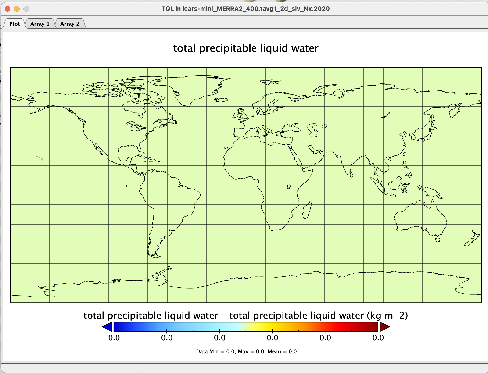
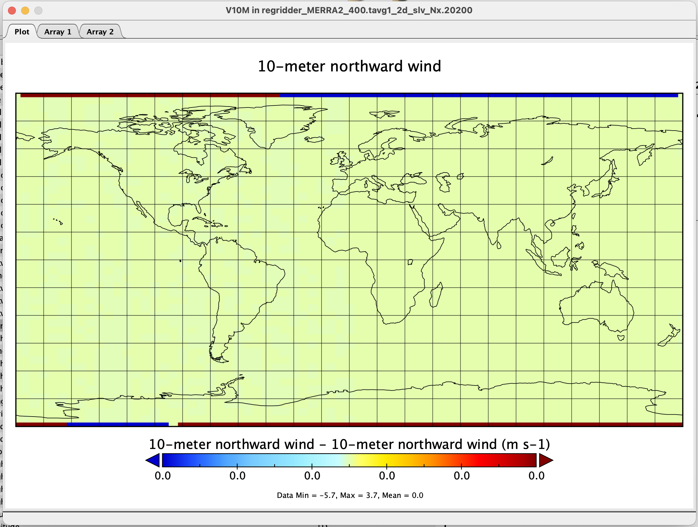
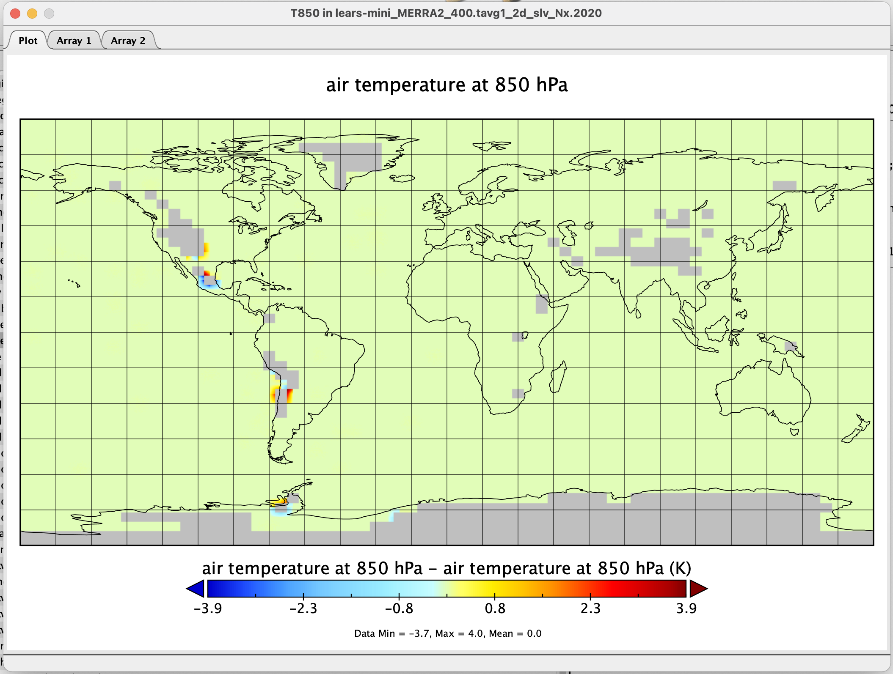
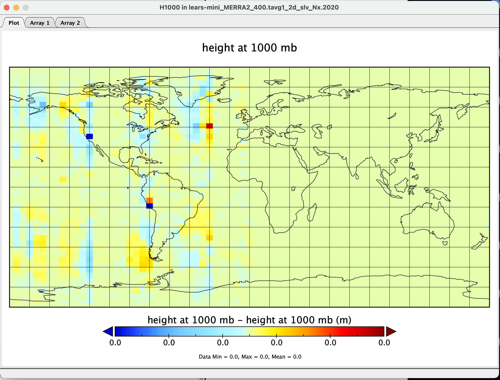
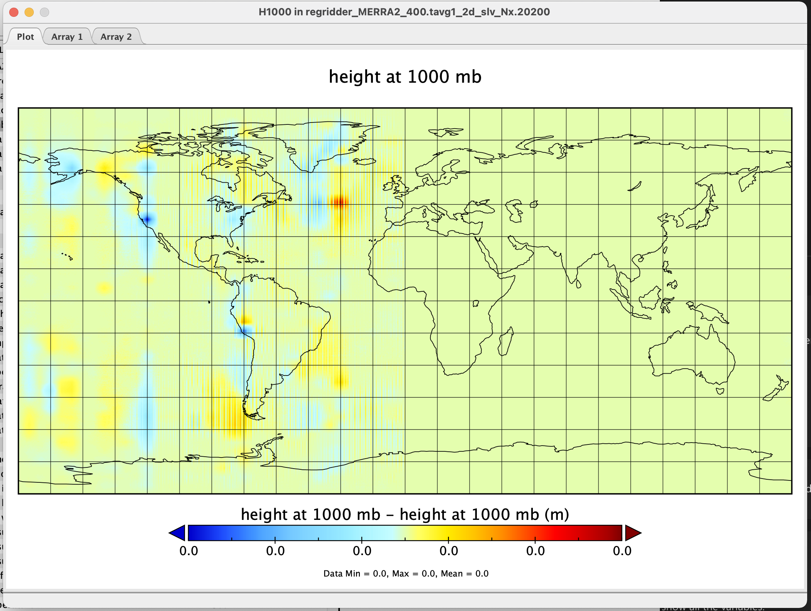

# Writeup for regridder_xesmf.py
Author & Developer: Maggie Trimpin
Updated: 07/19/2022
Current version: 1.3

# Workflow
Input: .json file with the following information:
```
{ 
	"in_dir": input file, if the path is a directory such as ../data/*.nc4, then deal with all the nc4 files,
	"debug": true or false. when it's false, dont output anything to display,
	"regridding":[regridding interpolation, target grid resolution],
	"out_key": when it = "" (empty), then the output file name = json file name + in_dir, otherwise the output file name = in_dir + outkey + .nc4
}
```
The json file is passed to the main regridder() function as a sole parameter, where each key value is analyzed. 

As shown in the json input file above, the "in_dir" is where the user should supply the path to the netcdf file(s) for processing. 
If the "in_dir" field is a directory path rather than a file path, the script runs the following processes on each .nc4 file in the directory. 
Otherwise, it simply performs the operation on the one input file. Xarray also includes support for OPeNDAP (via the netCDF4 library or Pydap), 
which lets us access datasets over HTTP. Thus, the "in_dir" field can also be a link to a remote dataset, which the code can open and process accordingly. 

Next, the "debug" field can be set to True or False, based on whether the user would like the program to output diagnostic updates to the compiler. 
Additionally, if "debug" is set to false, the program will delete any files created during processing upon completion (not including the processed dataset that is output). 
Otherwise, any files created during processing will remain. 

Once all of the fields are read from the json file, the netcdf file(s) for analysis are opened as xarray datasets, and the script calls the regrid() function on each one. 

In the regrid() function, the desired interpolation and resolutions are read from the json file and interpreted by the script. 
The interpolations available are bilinear and nearest neighbor, and the available resolutions are accessible by calling the pregrid_generate() function.

pregrid_generate() contains a series of if statements that aim to match the input string with an existing defined resolution. For example, if the resolution was listed
as "fv4x5", pregrid_generate() would traverse the options until the option "fv4x5" is found, and upon entering that statement block, the script would extract
the corresponding resolution information (xsize, ysize, xfirst, xinc, yfirst, yinc). These values are then outputted to a gridfile in a temporary directory, 
and control is returned to regrid(). In regrid, the gridfile is opened and the values from the file are interpreted to a geo-referenced perspective 
(ie. latitude_lowerlimit, latitude_upperlimit, latitude_step, etc), and regridding is performed with those parameters. 

Finally, the regrid dataset is returned to regridder(), and subsequently passed to output(), where it is converted to netcdf once more, and stored in 
the designated temporary directory.

# Development
Regridder.py was developed in python using the xarray and xESMF python packages for dataset processing and regridding. NCO function nccmp was used to compare the output files of regridder.py to that of the lears-mini tool, which is a smaller version of the on-prem L34RS (Level 3/4 Regridding Subsetter) tool. 

A threshold of 0.0001 is currently being used for comparison. In other words, if differences between outputs from regridder.py and lears-mini exist, they will only be outputted if they are larger than the threshold. 

# Current Status
Though working, the regridder is providing results that are unfortunately not always identical to that of the lears tool-mini. Examples are shown below, with multiple variables regridded from the dataset **MERRA2_400.tavg1_2d_slv_Nx.20200101.nc4**. Bilinear interpolation was used with geos4x5 resolution (resolution parameter details can be found in params.py function of regridder.py).

## 1. Example of Successfuly Regridded Variable - TQL
There exist a number of variables that produce identical results between lears-mini and regridder.py. An example is shown below.
  

## 2. Example of Variable Displaying Differences at Poles - V10M
Though many variables are able to produce the desired outcome in regridder.py, many variables experience issues with different values at the poles. One example is shown below.
  

## 3. Example of Variable Displaying Differences Around Holes in ds (NaN/ missing value discrepancies) - T850
Some variables display no issues at the poles, but rather a discrepancy with NaN/ missing values around holes in the dataset. An example is shown below. However, upon closer inspection, it appears as though the differences in these values, when not interpolated, are actually quite small (<.0001). Therefore, these issues have been momentarily ignored, in favor of finding a solution to the discrepancies at the poles. 
  


## 4. Example of Variable Displaying "Random" Tiny Differences in Western Hemisphere - 
Perhaps the most confusing of all, many variables are showing significantly small (3.36103e-18 , 1.13505e-09, etc) differences at random points in the dataset, *all in the western hemisphere only*. 


---- 
# Taking a Closer Look at the Difference Values

| Variable         |  Issue Category | Value differences|
| :------- | :----------: | :------: |
|<ul><li>U10M<li>U250<li>U2M<li>U500<li>U50M<li>U850<li>V10M<li>V250<li>V2M<li>V500<li>V50M<li>V850</li></ul> |  Problems at the poles | Large(r) values in comparison (ranging from 5.69824 to as much as -20.8906 difference)| 
|<ul><li>CLDPRS<li>CLDTMP<li>Q850<li>T850<li>TROPPT<li>TROPPV </ul>| 		NaN/ Missing value discrepancy surrounding holes in data		 | 		nan (mean,sum,abssum,stddev), 1e+15 (max,range) | 
| <ul><li>DISPH<li>H1000<li>H250<li>H500<li>H850<li>OMEGA500<li>PBLTOP<li>PS<li>Q250<li>Q500<li>QV10M<li>QV2M<li>SLP<li>T10M<li>T250<li>T2M<li>T2MDEW<li>T2MWET<li>T500<li>TO3<li>TOX<li>TQI<li>TQL<li>TQV<li>TROPPB<li>TROPQ<li>TROPT<li>TS<li>ZLCL</li></ul>| 		Periodic random diffs in the western hemisphere 			| 			Extremely small values (ie. 3.36103e-18 , 1.13505e-09), ignored by TEA, do not appear in diffs.txt 			|


## Problems at the Poles
The biggest problem variabes as of now are those in the first row, displaying differences only at the North and South poles. When analyzing which actual latitude values are affected, it appears that it is only values exactly at -90 and 90 latitude. Even when regridded to an extremely fine resolution (ie. .25x.25), only -90 and 90 are giving issues. These "issues" are once again only present in the U and V variables, which are representative of eastward and northern winds at certain heights/pressures. This is likely because as latitude approaches the north and south poles, there becomes fewer and fewer values, and thus xESMF must simply copy values across all longitudinal values, hence the repeated values across the board. Cdo must handle them differently. 

### Current Attempts to Fix
In the past we have tried methods such as (ESMPY pole method, periodic=true in regridder definition (apparently optimal for global regridding?), ignore_degenerate idk).

Another method attempted has been to simply concatenate the original pole values onto the regridded dataset. This has proven inaffective, as the values at the poles already match the regridded ones. 


## NaN/ Missing value discrepancy surrounding holes in data	
To be explored

## Periodic random diffs in the western hemisphere 
TEA has been adjusted to ignore the tiny value differences (< .0001). However, it does not dismiss the fact that there are discrepancies occurring with some regridded varialbes. Upon closer inpection, it is not an issue of xesmf vs cdo- when a dataset is regridded with the *same tool* and *same resolution*, but with *different longitudinal ranges*, differences are still present. For example, our example dataset was regridded twice by regridder.py, once with the resolution fv4x5, and again with the resolution geos4x5. These resolutions both have a 4x5 step, and range from -90 to 90 latitude. The only difference is that geos4x5 ranges from longitude -180 to 180, and fv4x5 ranges from 0 to 360. Here is the regridded H1000 variable from the two datasets, compared in panoply: 



The differences are apparent even when regridded with the same tool and same resolution, once again only in the western hemisphere. Additionally, using the geos4x5 resolution with regridder.py and lears-mini yield the same results for this variable. The only explanation is that xesmf is having difficulty rotating the globe when regridding, in the cases of converting longitudinal ranges (-180:180 to 0:360).

### Current Attempts to Fix

A solution is potentially possible when one manually rotates the input dataset, in the event that the desired resolution is to a different longitude range. Then, the target grid is to be interpreted as though it is in the original range, by subtracting the differences between the original grid limits and the target grid limits. The new, adjusted dataset can then be regridded with the adjusted regridder. 

## Posts to message boards

[Regrid discrepancy between xESMF and CDO ](https://github.com/pangeo-data/xESMF/issues/151)

[xESMF regridding showing repeated values at latitude poles](https://github.com/pangeo-data/xESMF/issues/133)

[Inconsistent NaN value placements](https://github.com/pangeo-data/xESMF/issues/154)

[Is xesmf.util.grid_global() leaving out data at poles? ](https://github.com/pangeo-data/xESMF/issues/157)

[Wondering how xESMF handles switching coordinate systems?](https://github.com/pangeo-data/xESMF/issues/159)