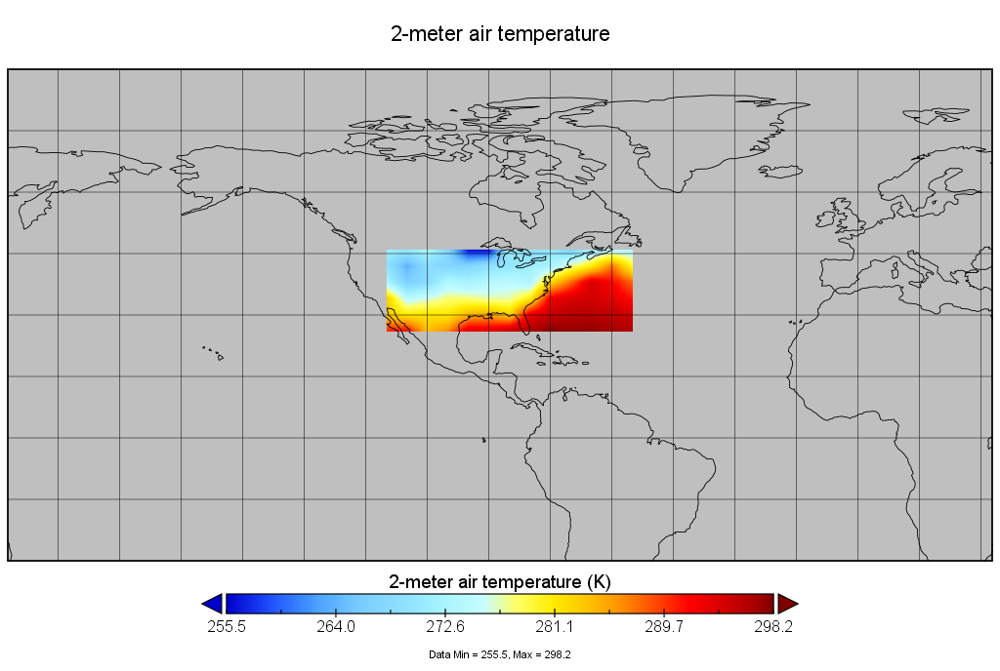
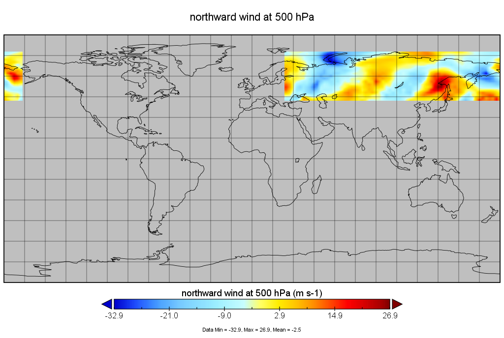
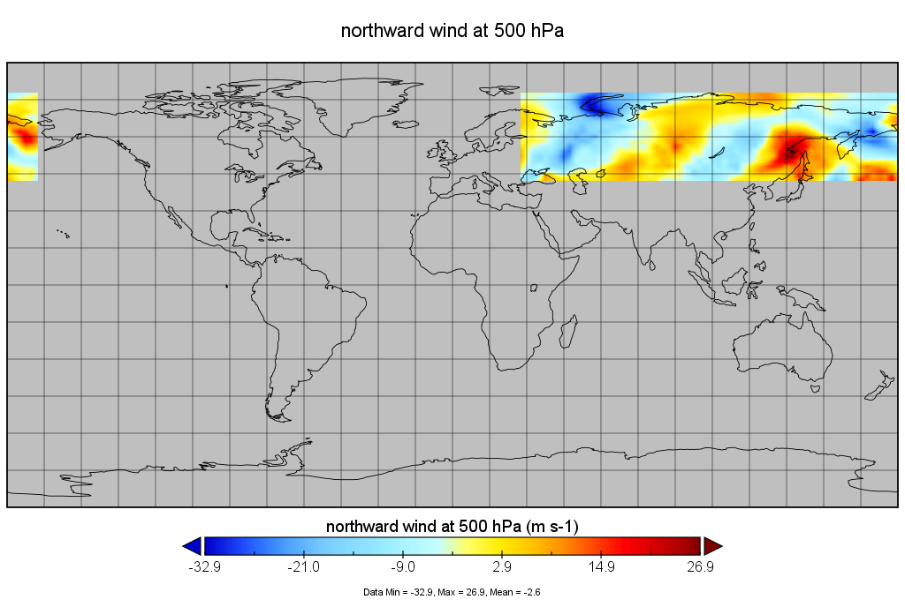

# Test of Regridding on Smaller Input Grids (non-global)
Author: Maggie Trimpin
ver 1.
Updated 11-05-2021

---
## Example #1 
Input Options: 

```
"in_dir":"../../data/MERRA2_400.tavg1_2d_slv_Nx.20200101.nc4",
"subset_spatial":[-115.7, -54.5, 23.3, 49.7],
"regridding":["remapbil","fv4x5"],
```

Output from TEA: GRASS and Lears-mini produce identical files. 
Panoply comparison, with arbitrary variable T2M: 

GRASS-generated T2M           |  Lears-mini-generated T2M
:-------------------------:|:-------------------------:
  |  

## Example #2 
Input Options: 

```
"in_dir":"../../data/MERRA2_400.tavg1_2d_slv_Nx.20210930.nc4",
"subset_spatial":[25.4, -167.3,	41.3, 78.3], #NOTE: lon bounds cross anti-meridian
"regridding":["remapnn","geos2x25"],
```

Output from TEA: GRASS and Lears-mini produce identical files. 
Panoply comparison, with arbitrary variable V500: 

GRASS-generated V500           |  Lears-mini-generated V500
:-------------------------:|:-------------------------:
  |  