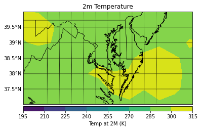
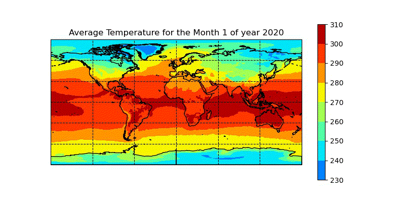
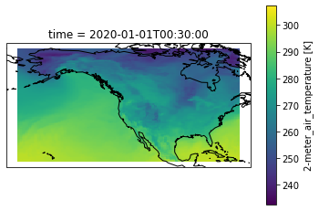
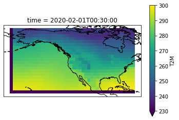

# Project Progress Research Journal 
Updated: 11/17/2021

Author: Maggie Trimpin

---

# Title
GRASS: The New Subsetter/Regridder For GES DISC

# Abstract

The goal of this research project has been to develop a subsetter and regridder to replace the current tool in use, LEARS (Level 3/4 Subsetting Regridder). Though working, LEARS has limited functionality and is far from optimized; both factors that prompted this research. 

The tool that has been developed over the course of this project has been named GRASS (the GESDISC Regridding and Subsetting System). This tool was developed in Python, using the Xarray package for netCDF dataset processing, and all forms of subsetting. xESMF was used for regridding, with bilinear, conservative, nearest neighbor and patch interpolations supported. The data used for experimentation were MERRA-2 netCDF files (mention exact ones?) obtained from the GESDISC website. 

At this point in time, GRASS can perform all operations that LEARS can (spatial, temporal, and variable subsetting and regridding), and produces identical output. Additionally, through time and memory resource allocation monitors, GRASS has proven to be more memory-efficient than LEARS on all operations. 

Special features of GRASS include the ability to subset spatially across the anti-meridian. This was not originally a capability of Xarray, but GRASS is able to divide a subset on both sides of the prime meridian and concatenate them, producing the expected result. Additionally, GRASS is able to temporally subset not only by range(ie. 4-8), but also by selection of individual indicies (ie. 1,3,5), and a combination of the two (ie. 1-3, 5, 7-9, 11).

Additionally, unlike LEARS, GRASS is able to import remote datasets using xarray.

Though working, GRASS is not fully ready for implementation. GRASS still has limitations on global regridding- Any regridded plots must be spacially subsetted as well in order to produce accurate output. Additionally, vertical subsetting has not yet been implemented. 

# Introduction / Background

The NASA Goddard Earth Sciences Data and Information Services Center (GES DISC) Level 3/4 Regridder and Subsetter (LEARS) has been the primary subset and regrid tool used for Earth Satellite Data since early 2018. It is one of the most popular HTTP services at the center in terms of number of files and volume of data moved. This tool provides the ability to subset spatially, temporally, vertically and by variable, and regrid based on a variety of different interpolations and resolutions. However, the LEARS tool is still limited in some functionality and is far from optimized. Thus, this project aims to develop a new, more optimal subsetter and regridder, for eventual replacement of the current LEARS tool.


# Section 1: Subsetting
## Background

**Subsetting** is the process of retrieving just the parts of large files which are of interest for a specific purpose. This occurs usually in a client—server setting, where the extraction of the parts of interest occurs on the server before the data is sent to the client over a network. The main purpose of subsetting is to save bandwidth on the network and storage space on the client computer.

**Why Subset Data?**
* restrict or divide the time range
* select cross sections of data
* select particular kinds of time series
* exclude particular observations

More subsetting details can be found in the Subsetting_Tools_Libs_Research.md file. 

In the context of this project, we wish to create a tool that can subset Earth data spatially, temporally, vertically, and by variable. My first endeavor was to explore methods of netCDF file subsetting.

The package I used to import, analyze and subset our datasets was [xarray](http://xarray.pydata.org/en/stable/).

## Spatial Subsetting Demonstration

**Import netCDF dataset**

In this example, we are using the hourly dataset M2T1NXSLV, on the 1st of January 2020.

```
fn = r'../data/MERRA2_400.tavg1_2d_slv_Nx.20200101.nc4' 
```

(Using netCDF4)

```
ds = nc.Dataset(fn)  # read as netcdf dataset
ds
```

## Subset the data by lat/long bounds

First we will demonstrate the ability to create a subset of just one of the US states.

Ex: Maryland has the following boundaries

Longitude: 74°' W to 79°' W

Latitude: 37°' N to 39°' N

```

latbounds = [ 74 , 79 ]
lonbounds = [ -39 , -37 ] # degrees east ? 
lats = ds.variables['lat'][:] 
lons = ds.variables['lon'][:]

#latitude lower and upper index

latli = np.argmin( np.abs( lats - latbounds[0] ) )
latui = np.argmin( np.abs( lats - latbounds[1] ) ) 

#longitude lower and upper index

lonli = np.argmin( np.abs( lons - lonbounds[0] ) )
lonui = np.argmin( np.abs( lons - lonbounds[1] ) )  

#Take arbitrary variable, T2M (temperature at 2m)
t2mSubset = ds.variables['T2M'][ : , latli:latui , lonli:lonui ]
T2M = ds['T2M'][:] #get data for variable
```

## Map subset of Maryland

```
map = Basemap(projection='merc',llcrnrlon=-80.,llcrnrlat=37.,urcrnrlon=-73.,urcrnrlat=40.,resolution='i') # projection, lat/lon ex

lons,lats= np.meshgrid(lons-180,lats) # for this dataset, longitude is 0 through 360, so you need to subtract 180 to properly display on map

x,y = map(lons,lats)
map.drawcoastlines()
map.drawstates()
map.drawcountries()

map.drawlsmask(land_color='Linen', ocean_color='#CCFFFF') #can use HTML names or codes for colors

map.drawcounties() # 
you can even add counties (and other shapefiles!)

parallels = np.arange(37,40,.5) # make latitude lines every .5 degrees from 30N-50N

meridians = np.arange(-79,-74,.5) # make longitude lines every .5 degrees from 95W to 70W

map.drawparallels(parallels,labels=[1,0,0,0],fontsize=10)

map.drawmeridians(meridians,labels=[0,0,0,1],fontsize=10)

temp = map.contourf(x,y,T2M[0,:,:])
cb = map.colorbar(temp,"bottom", size="5%", pad="2%")

plt.title('2m Temperature')
cb.set_label('Temp at 2M (K)')
```



My research brought me not only to exploring spatial subsetting, but also temporal.

## Temporal Subsetting Demonstration 

This subsetting/visualization will be done using xarray, and using the 2020 Monthly data

**Import netCDF concatenated with all months in 2020**
```

ds = xr.open_dataset(r'../data/MERRA2_400.tavgM_2d_slv_Nx.2020_allMonths.nc4')

monthly_means = ds.groupby("time.month").mean()
monthly_means.T2M.attrs = ds.T2M.attrs
monthly_means


fig = plt.figure(figsize=(8, 6), edgecolor='w')

mp = Basemap(projection='cyl', resolution=None,
            llcrnrlat=-90, urcrnrlat=90,
            llcrnrlon=-180, urcrnrlon=180, )

longs = ds['lon'][:]
lats = ds['lat'][:]
T2M = ds['T2M']
lon, lat = np.meshgrid(longs,lats)
x,y = mp(lon,lat)
plt.figure(figsize=(6,8))

```

Loop for all the months of the year

```
os.chdir(r'C:/Users/mtrimpin/Documents/Data/')
months = np.arange(0,12)  # for considering all days of the year

for i in months:
    fig = plt.figure(figsize=(8,4))
    ax = plt.axes(projection=ccrs.PlateCarree())
    ax.set_global()
    ax.add_feature(cartopy.feature.GSHHSFeature(edgecolor='k'))
    ax.gridlines(linestyle='--',color='black')
    plt.contourf(longs, lats, T2M[i,:,:], transform=ccrs.PlateCarree(),cmap=plt.cm.jet,vmin=210,vmax=310)
   #plt.clim(210,310)
    plt.colorbar()
    month = i+1
    plt.title('Average Temperature for the Month ' + str(month) +  ' of year 2020')
    plt.savefig(r'./MERRA2_2020_T2M_image_files'+ '//' + str(month)+'.jpg')
    plt.show()

```

For aid of visualization, I created a gif looping through the months of 2020



# Section 2: Regridding
## Background
**Regridding** is the process of interpolating from one grid resolution to a different grid resolution. This could involve temporal, vertical or spatial ('horizontal') interpolations. However, most commonly, regridding refers to spatial interpolation.


**Why Regrid Data?**
Geospatial gridded datasets (climate models, remote sensing images, etc.) frequency exist on dissimilar grids. Regridding is a method of combining various gridded datasets on one plot

Grids used in climate research fall into several categories: regular, rectilinear, curvilinear and unstructured. Grids described by one-dimensional latitude and longitude coordinate will be called rectilinear; grids where the coordinates are two-dimensional will be called curvilinear; and, grids in which the grid coordinates require a list of nodes (connectivity information) will be called unstructured.

Our GRaSS tool will be able to regrid a given dataset with a chosen interpolation method and grid resolution, specified in the input json file by the user. 

These interpolation options include:
1. bilinear
2. nearest neighbor
3. inverse distance
4. spline
5. binning
6. spectral 
7. triangulation

Details about these interpolations can be found in the Regridding_Tools_Libs_Research.md file. 

Our chosen regridding tool was decided to be [xESMF](https://xesmf.readthedocs.io/en/latest/), largely due to its compatibility with xarray, which was used for our subsetting operations. Additionally, xESMF provides functionality with all required ESMF regridding algorithms, listed above.

## Go through the regridding process
In this example, we are using the same dataset as the subsetting example above- the hourly dataset M2T1NXSLV, on the 1st of January 2020.

```
fn = r'../data/MERRA2_400.tavg1_2d_slv_Nx.20200101.nc4' 
```

(Using xarray)

```
ds = xr.open_dataset(fn) # read as xarray dataset
ds
```

It is usually a good time to subset by variable prior to regridding, if applicable, as it is far easier to work with smaller datasets. In this example, we will work with an entire dataset.


Once we have imported our dataset with xarray and selected our variables of interest, we must build a regridder.

The input for the regridder corresponds to the desired latitude/longitude limits of the dataset, the desired resolution of the output grid, and the interpolation method. 

Say we wish to create a 4x5 output grid of the whole globe. Then, our "step" inputs will be 4 for latitude and 5 for longitude. Our latitudinal limits will be -90 to 90, and the longitudinal limits -180 to 180. (Note: the xarray regridder supports multiple coordinate system grids; 0:180 latitude and 0:360 longitude can also be used). For the sake of demonstration, we will use bilinear interpolation.

```
ds_out = xr.Dataset({'lat': (['lat'], np.arange(-90, 90, 4)),
                     'lon': (['lon'], np.arange(-180, 180, 5)),
                    }
                   )

regridder = xe.Regridder(ds, ds_out, 'bilinear')
```
Upon printing the regridder, the following text is displayed:


```
xESMF Regridder 
Regridding algorithm:       bilinear 
Weight filename:            bilinear_361x576_45x72.nc 
Reuse pre-computed weights? False 
Input grid shape:           (361, 576) 
Output grid shape:          (45, 72) 
Periodic in longitude?      False
```

Finally, we apply the regridder to our dataset.

```
ds_out = regridder(ds)
```

## Visual Example
Here we will see a graphic example with the same dataset
 ```
fn = '../data/MERRA2_400.tavg1_2d_slv_Nx.20200101.nc4'
ds = xr.open_dataset(fn) 

input_var = 'T2M'
var = ds[input_var]  # returns a DataArray
```

For the sake of demonstration, we will regrid on a spatial subset of North America
```
latll = 18
latul = 71
lonll = -172
lonul = -67

new_ds = ds.sel(time = ds.variables['time'],lon = slice(lonll,lonul), lat=slice(latll,latul))

var = new_ds["T2M"]
vmax = var.max() #for the colorbar range
vmin = var.min() #for the colorbar range

ax = plt.axes(projection=ccrs.PlateCarree())
var.isel(time=0).plot.pcolormesh(ax=ax, vmin=vmin, vmax=vmax);
ax.add_feature(cartopy.feature.GSHHSFeature(edgecolor='k'))
```


Upon analysis of the latitude and longitude values of the dataset, we see that the input data has a grid resolution of 0.5∘ x 0.7∘. 

Say we want to upsample it to 5∘ x 7∘. We need only define the output grid as an xarray Dataset, and define our regridder accordingly:

```
ds_out = xr.Dataset({'lat': (['lat'], np.arange(latll, latul, 5)),
                     'lon': (['lon'], np.arange(lonll, lonul, 7)),
                    }
                   )

regridder = xe.Regridder(var, ds_out, 'bilinear')
```
Upon printing the regridder, the following text is displayed:

```
xESMF Regridder 
Regridding algorithm:       bilinear 
Weight filename:            bilinear_107x168_22x42.nc 
Reuse pre-computed weights? False 
Input grid shape:           (107, 168) 
Output grid shape:          (22, 42) 
Periodic in longitude?      False
```

Finally, apply the regridder to our subsetted dataset
```
var_out = regridder(var)

ax = plt.axes(projection=ccrs.PlateCarree())
var_out.isel(time=0).plot.pcolormesh(ax=ax, vmin=230, vmax=300);
ax.add_feature(cartopy.feature.GSHHSFeature(edgecolor='k'))
```

The output grid is shown below. Npte the decrease in resolution with the increased step values. 




# Section 3: Subsetting and Regridding Tool Implementation

## File Input Layout
The input files will be created in .json format, with the following information:
```
{ 
	"in_dir": input file, if the path is a directory such as ../data/*.nc4, then deal with all the nc4 files,
	"debug": true or false. when it's false, dont output anything to display,
	"subset_spatial":[lon1, lon2, lat1, lat2],
	"subset_temporal": [Range (ie. "1/5"), individual indicies (ie. 1,2,4,6,7), or combination]
    "subset_variable": [One or more variables],
	"subset_vertical":[], #Yet to be implemented
	"regridding":[regridding interpolation, target grid resolution],
	"out_key": ""  when it = '' (empty), then the output file name = json file name + in_dir, otherwise the output file name = in_dir + outkey + .nc4
}
```

The json file is passed to GRaSS, where each key value is analyzed. 

As shown in the json input file above, the "in_dir" is where the user should supply the path to the netcdf file(s) for processing. If the "in_dir" field is a directory path rather than a file path, the script runs the following processes on each .nc4 file in the directory. Otherwise, it simply performs the operation on the one input file. Xarray also includes support for OPeNDAP (via the netCDF4 library or Pydap), which lets us access datasets over HTTP. Thus, the "in_dir" field can also be a link to a remote dataset, which the code can open and process accordingly. 

Next, the "debug" field can be set to True or False, based on whether the user would like the program to output diagnostic updates to the compiler. Additionally, if "debug" is set to false, the program will delete any files created during processing upon completion (not including the processed dataset that is output). Otherwise, any files created during processing will remain. 

For the five fields reserved for subsetting and regridding, the program checks the values for each key. If a given key is not empty, a method is called to perform the subsetting or regridding operation that corresponds to the key title and value(s).  

GRaSS checks for each key in the following order:
### **Variable Subsetting**
If the field for 'subset_variable' is not empty, the program passes the working dataset and the data file to the variable_subset() function.

Variable_subset extracts the string or list of string corresponding to variables to include, supplied by data['subset_variable'].

Output: new netCDF, containing dataset information subsetted to include only variables passed to function

```
def variable_subset(data_set, data):
    subset_variable = data['subset_variable']
    new_netcdf = data_set[subset_variable].to_netcdf()
    return new_netcdf
```

### **Regridding**
If the field for 'regridding' is not empty, the program passes the working dataset and the data file to the regrid() function, along with debug (boolean).

The regrid function reads and interprets the interpolation method from data['regridding'].
It then creates a temporary directory, in which it writes a gridfile containing information about grid resolution. This gridfile is generated by calling params.py. Regrid then reads from the gridfile and regrids the dataset accordingly. 

Once regridding is complete, if debug == false, the temporary directory is deleted, along with any files created during runtime.

Output: new dataset, regridded according to the inputted interpolation and resolution information

```
def regrid(data_set, data, debug):
    #create a temporary directory for gridfile
    #generate timestamp for temp_dir
    time_stamp = time.time()
    temporary_dir = f"../../../tmp/grass_temporary_dir_{time_stamp}"
    os.mkdir(temporary_dir)

    interpolation = data['regridding'][0]
    #interperet interpolations from params.py
    if interpolation == 'remapbil':
        interpolation = 'bilinear'
    elif interpolation == 'remapbic':
        print('remapbic')
    elif interpolation == 'remapdis':
        interpolation = 'inverse distance'
    elif interpolation == 'remapnn':
        interpolation = 'nearest_s2d'
    elif interpolation == 'remapcon':
        interpolation = 'conservative'
    elif interpolation == 'remapcon2':
        print('remapcon2')
    elif interpolation == 'remaplaf':
        print('remaplaf')

    #Search params.py for matching resolution
    data["TMPDIR"] = temporary_dir #temporary output dir created at beginning of perform_operation
    data["gridfile"] = params.pregrid_generate(data) #outputs a path to the gridfile location
    gridfile = open(data["gridfile"], 'r')

    gridfile_list = gridfile.readlines()
    str_values = "".join(gridfile_list)

    values = re.findall(r'-?\d*\.\d+|\d+|-?\d+', str_values)

    lonll = float(values[2])
    lonul = float(values[2]) + float(values[0]) * float(values[3])
    lon_res = float(values[3])
    latll = float(values[4])
    latul = float(values[4]) + float(values[1]) * float(values[5])
    lat_res = float(values[5])

    #Output grid, using values specified by input file
    output_grid = xarray.Dataset({'lon': (['lon'], np.arange(lonll, lonul, lon_res)),
                     'lat': (['lat'], np.arange(latll, latul, lat_res)),
                    }
                   )

    #Get options from "./lears-mini/lears/params.py"
    regridder = xesmf.Regridder(data_set, output_grid, interpolation,  periodic=True)
    ds_out = regridder(data_set,keep_attrs=True)
    
    if not debug: #delete temporary directory if created
        shutil.rmtree(temporary_dir, ignore_errors=True)
    return ds_out
```

### **Spatial Subsetting**
If the field for 'subset_spatial' is not empty, the program passes the working dataset and the data file to the spatial_subset()  function.

Spatial_subset reads the lat/lon upper and lower limits from data['subset_spatial'] and then subsets the dataset based on said values.

Xarray is unable to interpret subsetting across the International Date Line (ie. latLL = 160, latUL = -160). Thus, if that is the case, two separate datasets are processed, one for each side of the IDL, and concatenated, then returned as one new dataset.

Output: new dataset, subsetted spatially in accordance with input lat/lon values

Noteworthy features: Subsetting across IDL

```
def spatial_subset(ds, data):
    coordinates = data['subset_spatial']
    lonll = int(coordinates[0])
    lonul = int(coordinates[1])
    latll = int(coordinates[2])
    latul = int(coordinates[3])

    if lonll < lonul: #normal order
        new_ds = ds.sel(time = ds.variables['time'],\
        lat=slice(latll,latul), lon = slice(lonll,lonul))
        return new_ds

    else: #if crosses antimeridian
        lat_index = slice(latll,latul)
        #split into two, where prime meridian is crossed
        lon_left_of_idl = slice(lonll, 180)
        lon_right_of_idl = slice(-180, lonul)
        lon_index = xarray.concat((ds.lon.sel(lon=lon_right_of_idl),
                                ds.lon.sel(lon=lon_left_of_idl)), dim='lon')
        indexers = {'lon': lon_index, 'lat': lat_index}
        ds = ds.sel(**indexers)
    
    reindexed_ds = ds.reindex_like(ds.lon)
    new_ds = reindexed_ds.where(((reindexed_ds.lon < lonul).any() and (reindexed_ds.lon > lonll).any()), drop=True)
    return new_ds
```

### **Temporal Subsetting**
If the field for 'subset_temporal' is not empty, the program passes the working dataset and the data file to the temporal_subset() function. 

Temporal_subset reads the input indicies/slices from data['subset_temporal'] and appends them to a list of indicies. These indicies are then 
converted to a dictionary, and xarray then uses them to index the dataset, with each number corresponding to the 
number of hours after datetime64 00:30:00.00

Output: new dataset, subsetted tempotally by selecting only the temporal values included in the time dictionary.

Noteworthy features: Ability to subset temporal indicies (1,3,5), slices (5-8), or both (1, 3-6, 9)

```
def temporal_subset(data_set, data):
    subset_temporal = data['subset_temporal']
    indicies = []
    #"subset_temporal":[1,3/5,7,9]
    for item in subset_temporal:
        if isinstance(item, int):
            #if current item is an integer, add it to index array
            indicies.append(item - 1)
        else: #current item is of type "start-end"
            #extract integers on right and left of "-"
            index_range = re.findall('\d+', item)
            start_indx = int(index_range[0])
            stop_indx = int(index_range[1])
            for i in range(start_indx - 1, stop_indx):
                indicies.append(i)

    dictionary = {"time": indicies}

    new_ds = data_set.isel(dictionary)
    return new_ds
```


### **Not Yet Implemented: Vertical Subsetting**
(brief explanation of what it is)

---

Once all of the operations are complete, a new nc4 file is outputted to the folder of the original input file, with a name identifiable by the name of the tool, the input json, the nc4 file for processing, and the out_key provided by the json key. If an out_key is not provided, then the output file name = json file name + input file name. Example: grass_regridding_MERRA2_400.tavg1_2d_slv_Nx.20200101_key.nc4.

An additional parameter, "NaN_to_missing_val", is used to determine whether or not to convert any NaN values within a dataset to the "missing_value" specified in the attributes of each dataset. With a default value of "True," this parameter promts the system to read from the dataset attributes, obtain the default "missing value," and convert all NaN values within the dataset to that value. This functionality comes in handy when we use our comparison tool, TEA, to evaluate the results of multiple different tools' output files of the same dataset, to ensure they have their missing values set to the same number. 

# Section 4: nc4 Comparison using TEA (Tool Equivalence Analyzer)
Files subsetted and regridded by our GRASS tool will be compared to those subsetted and regridded by another tool (for the sake of our experimentation, the LEARS Mini tool will be used) with the same input values. The files will be compared using the [NCO](http://nco.sourceforge.net/) tool nccmp, in our TEA. 

TEA reads the input json file and searches for existing output files from each tool for that file. If the files do not exist, then TEA runs each tool on the input file, where an output netcdf file is generated. TEA then runs the ncdiff operation on the generated output files in the command line. If the output files already exist, TEA simply compares the existing fies. 

If the files are identical, the program reports as such. If differences in the comparison files are detected, they are outputted to a text file in a temp directory, with a name corresponding to the names of the two tools and json file under evaluation. The program will display whether the files are identical, the path to the output text file, and the memory and time report from runtime (only if TEA must run either of the tools; it is not necessary if TEA compares existing output files).

# Section 5: Efficiency/ Functionality Evaluation against Lears-mini

In addition to assuring that both GRASS and Lears-mini produce identical output, we wish to prove that GRASS proves more efficient, whether it be in terms of time or memory. 

**Note: Tool 1: Lears-mini --- Tool2: GRASS**

### **Variable Subsetting**
Example 1: With single subset variable:

`subset_variable: ['ZLCL'] `

    Time taken for tool 1 execution: 2.253  seconds
    Memory used for tool 1 execution:  718  KiB

    Time taken for tool 2 execution: 6.006  seconds
    Memory used for tool 2 execution:  250  KiB

Example 1 run with avg time/mem monitor, run 25x:

    Avg time taken for Lears execution 1.601  seconds
    Avg memory taken for Lears execution:  270.0  KiB

    Avg time taken for Grass execution 2.011  seconds
    Avg memory taken for Grass execution:  250.0  KiB

Example 2: With multiple subset variable:

`subset_variable: ['V500', 'ZLCL', 'T2M']`

    Time taken for tool 1 execution: 4.611  seconds
    Memory used for tool 1 execution:  718  KiB

    Time taken for tool 2 execution: 4.902  seconds
    Memory used for tool 2 execution:  250  KiB

Example 2 run with avg time/mem monitor, run 25x:

    Avg time taken for Lears execution 4.384  seconds
    Avg memory taken for Lears execution:  270.0  KiB

    Avg time taken for Grass execution 3.184  seconds
    Avg memory taken for Grass execution:  250.0  KiB


Example 3: With multiple subset variable: run with avg time/mem monitor, run 25x:

`subset_variable: ["CLDPRS", "CLDTMP", "DISPH", "H250", "H500", "H850"]`

    Avg time taken for Lears execution 11.05  seconds
    Avg memory taken for Lears execution:  270.0  KiB

    Avg time taken for Grass execution 5.983  seconds
    Avg memory taken for Grass execution:  250.0  KiB


### **Regridding**
**Note: GRASS currently does not support global regridding. Thus, evaluation will be based on time/memory usage on combination of regridding and spatial subsetting**

Example 1:
    
`subset_spatial: [25.4, -167.3, 41.3, 78.3]`

`regridding: ['remapnn', 'geos2x25']`

    Time taken for tool 1 execution: 13.744  seconds
    Memory used for tool 1 execution:  774  KiB

    Time taken for tool 2 execution: 16.272  seconds
    Memory used for tool 2 execution:  282  KiB

Example 1 run with avg time/mem monitor, run 25x:

    Avg time taken for Lears execution 16.492  seconds
    Avg memory taken for Lears execution:  302.0  KiB

    Avg time taken for Grass execution 18.724  seconds
    Avg memory taken for Grass execution:  282.0  KiB


Example 2:
    
`subset_spatial: [5, 50,-10 ,80]`

`regridding: ["remapbil","fv4x5"]`

    Avg time taken for Lears execution 13.361  seconds
    Avg memory taken for Lears execution:  302.0  KiB

    Avg time taken for Grass execution 23.491  seconds
    Avg memory taken for Grass execution:  282.0  KiB
---

### **Spatial Subsetting**
Example 1:

`subset_spatial: [-175, -30, -10, 70]`
    
    Time taken for tool 1 execution: 21.786  seconds
    Memory used for tool 1 execution:  738  KiB

    Time taken for tool 2 execution: 13.023  seconds
    Memory used for tool 2 execution:  270  KiB

Example 1 run with avg time/mem monitor, run 25x:

    Avg time taken for Lears execution 20.133  seconds
    Avg memory taken for Lears execution:  290.0  KiB

    Avg time taken for Grass execution 7.125  seconds
    Avg memory taken for Grass execution:  270.0  KiB

Example 2: Note- crosses anti-meridian

`subset_spatial: [25.4, -167.3, 41.3, 78.3]`

    Time taken for tool 1 execution: 18.958  seconds
    Memory used for tool 1 execution:  764  KiB

    Time taken for tool 2 execution: 15.141  seconds
    Memory used for tool 2 execution:  272  KiB

Example 2 run with avg time/mem monitor, run 25x:

    Avg time taken for Lears execution 18.028  seconds
    Avg memory taken for Lears execution:  292.0  KiB

    Avg time taken for Grass execution 13.669  seconds
    Avg memory taken for Grass execution:  272.0  KiB
---

### **Temporal Subsetting**

Example 1: Indexed Subsetting

`subset_temporal: [1, 5]`

    Time taken for tool 1 execution: 6.021  seconds
    Memory used for tool 1 execution:  764  KiB

    Time taken for tool 2 execution: 9.778  seconds
    Memory used for tool 2 execution:  296  KiB

Example 1 run with avg time/mem monitor, run 25x:

    Avg time taken for Lears execution 3.346  seconds
    Avg memory taken for Lears execution:  316.0  KiB

    Avg time taken for Grass execution 5.462  seconds
    Avg memory taken for Grass execution:  278.0  KiB


Example 2: Range Subsetting

`subset_temporal: ["1-5"]`

    Time taken for tool 1 execution: 3.124  seconds
    Memory used for tool 1 execution:  722  KiB

    Time taken for tool 2 execution: 7.791  seconds
    Memory used for tool 2 execution:  254  KiB

Example 2 run with avg time/mem monitor, run 25x:

    Avg time taken for Lears execution 2.627  seconds
    Avg memory taken for Lears execution:  274.0  KiB

    Avg time taken for Grass execution 6.077  seconds
    Avg memory taken for Grass execution:  254.0  KiB


Example 3: Combination Index and Range Subsetting

`subset_temporal: [1, '3-5', 8, '10-11']`

    Avg time taken for Lears execution 16.616  seconds
    Avg memory taken for Lears execution:  274.0  KiB

    Avg time taken for Grass execution 11.071  seconds
    Avg memory taken for Grass execution:  254.0  KiB

Example 4: Combination Index and Range Subsetting (2)

`subset_temporal: [1, "2-4", 7, 8, "9-11"]`

    Avg time taken for Lears execution 16.608  seconds
    Avg memory taken for Lears execution:  274.0  KiB

    Avg time taken for Grass execution 13.661  seconds
    Avg memory taken for Grass execution:  254.0  KiB

---

### **All Possible Operations**
    config:
        in_dir: ../../data/MERRA2_400.tavg1_2d_slv_Nx.20200101.nc4
        debug: True
        subset_spatial: [-39, 26, 11, 90]
        subset_temporal: [3, 5, '7-10']
        subset_variable: ['ZLCL', 'T2M']
        regridding: ['remapnn', 'geos4x5']

    Time taken for tool 1 execution: 3.424  seconds
    Memory used for tool 1 execution:  726  KiB

    Time taken for tool 2 execution: 8.087  seconds
    Memory used for tool 2 execution:  258  KiB

Example run with avg time/mem monitor, run 25x:

    Avg time taken for Lears execution 1.934  seconds
    Avg memory taken for Lears execution:  278.0  KiB

    Avg time taken for Grass execution 3.192  seconds
    Avg memory taken for Grass execution:  258.0  KiB
    
    

### Remote Files

Example 1: Temporal Subset with Unidata file

`in_dir: http://test.opendap.org/opendap/hyrax/data/nc/20070917-MODIS_A-JPL-L2P-A2007260000000.L2_LAC_GHRSST-v01.nc`

`subset_temporal: [2, 6, 10]`

Example 1 run with avg time/mem monitor, run 25x:

    Avg time taken for Grass execution 6.875  seconds
    Avg memory taken for Grass execution:  242.0  KiB


`in_dir: https://www.unidata.ucar.edu/software/netcdf/examples/tos_O1_2001-2002.nc`

`subset_spatial: [10, 30, 50, 120]`

Example 2: Spatial Subset with Unidata file


### Other benefits 
environment sizes:

command: `~/miniconda3/envs$ du -hs {env_name}/`

grass_env: 539M

lears_env: 540M 

tea_env: 880M


# Section 6: Future Improvements
* GRASS currently does not support global regridding (xesmf limitation; cannot process data at the latitude poles. Awaiting response from developer).